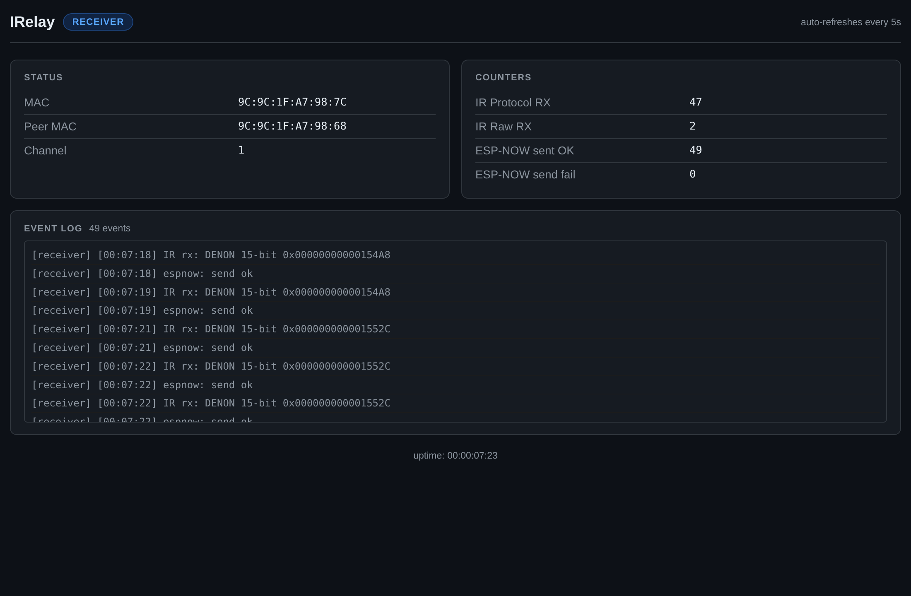

# esp8285-wireless-ir-extender

[](https://github.com/wesparish/esp8285-wireless-ir-extender/actions/workflows/ci.yml)
[](https://github.com/wesparish/esp8285-wireless-ir-extender/actions/workflows/ci.yml)

Relay IR remote commands over ESP-NOW between two rooms — no router, no broker, ~1ms latency.

One **receiver-node** captures IR from your remote and forwards the signal wirelessly to the **emitter-node**, which re-transmits it to the target device. The result is a seamless remote control experience with the device physically relocated.

**Hardware:** [HiLetgo ESP8285 ESP-01M IR Transceiver](https://www.amazon.com/dp/B09KGXNZ2Q) × 2  
**Programmer:** [DSD TECH SH-U09C5 USB to TTL UART Converter Cable (FTDI)](https://www.amazon.com/gp/product/B07WX2DSVB/) (5V — required for this module; requires manual wiring)

---

## Quickstart

### 1. Get each module's MAC address

Plug in each ESP8285 one at a time and run:

```bash
./bin/get-mac [port]
```

Note the MAC for each device.

### 2. Configure

```bash
cp include/config.h.example include/config.h
```

Edit `include/config.h` — set `ESPNOW_CHANNEL` (any 1–13, same on both nodes), `RECEIVER_NODE_MAC`, and `EMITTER_NODE_MAC`. The firmware selects the correct peer at compile time; one config file covers both flashes.

### 3. Flash

```bash
./bin/flash receiver-node   # the module that will receive IR from the remote
./bin/flash emitter-node    # the module that will re-transmit IR to the target device
```

That's it. Point your remote at the receiver-node and the emitter-node will retransmit.

---

## Web UI

Each node hosts a built-in diagnostic web UI over Wi-Fi. After flashing, connect to the `IR-Receiver-XXXX` or `IR-Emitter-XXXX` access point (no password) and navigate to `http://192.168.4.1/`. The page auto-refreshes every 5 seconds and shows live counters and an event log.



---

## Docs

- [Setup Guide](docs/setup.md) — full walkthrough including wiring and verification
- [Architecture](docs/architecture.md) — ESP-NOW design, payload format, pin rationale, CI/CD
- [bin/ Tools Reference](docs/bin-tools.md) — `get-mac`, `flash`, `monitor`
